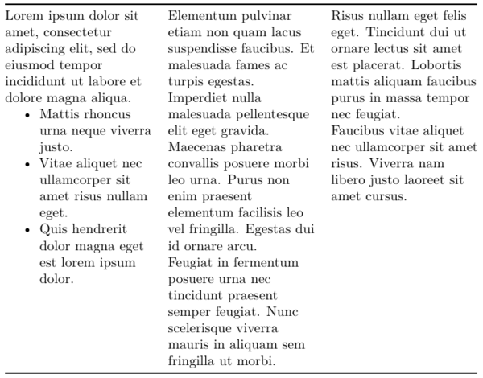
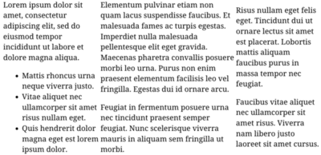

# pandoc-columns

This filter supports the definition of columns in Markdown.

## Usage

The "Example" section below explains how to use the Markdown
syntax extensions provided by this filter.
Then, you can format your document either using pandoc directly,
or through Hakyll.

### With Pandoc

Use this filter by adding `--filter=pandoc-columns` to your pandoc command.
For example:

    pandoc --filter=pandoc-linear-table myfile.md --output=myfile.pdf

### With Hakyll

Use this filter as a transform in Hakyll.
For example, you could modify `site.hs`, adding

```
import Text.Pandoc.Filters.Columns (transform)
```

and changing

```
pandocCompiler
```

to

```
pandocCompilerWithTransform defaultHakyllReaderOptions defaultHakyllWriterOptions transform
```

## Example

Sample PDF output:



Sample HTML output:



The markdown that produced the above outputs:

    ::: columns
    ::::: column
    Lorem ipsum dolor sit amet, consectetur adipiscing elit, sed do eiusmod
    tempor incididunt ut labore et dolore magna aliqua.

    * Mattis rhoncus urna neque viverra justo.
    * Vitae aliquet nec ullamcorper sit amet risus nullam eget.
    * Quis hendrerit dolor magna eget est lorem ipsum dolor.

    :::::
    ::::: column
    Elementum pulvinar etiam non quam lacus suspendisse faucibus.
    Et malesuada fames ac turpis egestas.
    Imperdiet nulla malesuada pellentesque elit eget gravida.
    Maecenas pharetra convallis posuere morbi leo urna.
    Purus non enim praesent elementum facilisis leo vel fringilla.
    Egestas dui id ornare arcu.

    Feugiat in fermentum posuere urna nec tincidunt praesent semper feugiat.
    Nunc scelerisque viverra mauris in aliquam sem fringilla ut morbi.


    :::::
    ::::: column
    Risus nullam eget felis eget.
    Tincidunt dui ut ornare lectus sit amet est placerat.
    Lobortis mattis aliquam faucibus purus in massa tempor nec feugiat.

    Faucibus vitae aliquet nec ullamcorper sit amet risus.
    Viverra nam libero justo laoreet sit amet cursus.
    :::::
    :::
